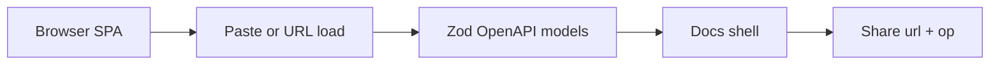

# Toolu Redoc

[](https://github.com/Falconiere/toolu-redoc/actions/workflows/ci.yml)

**OpenAPI docs that stay in the browser.**

Paste a spec or fetch one from a URL. Browse tags and operations, read schemas and
examples, and share a stable link to the operation you are looking at — all without
shipping your document to a hosted platform.

Built with React, Vite, Zod, and Bun. Deployed as a Cloudflare Workers SPA.

Deep run / load / CI guide: [`apps/redoc/README.md`](./apps/redoc/README.md).

## Features

- **Paste or URL** — load OpenAPI JSON or YAML from a text area, or from an absolute
  `http://` / `https://` link (`/?url=…` auto-loads on open).
- **OpenAPI 3.0 / 3.1** — documents are parsed into Zod-validated domain models.
- **Three-column Signal shell** — navigation, operation detail, and a Samples rail
  for schemas and examples.
- **Shareable deep links** — Copy link embeds `url` + `op` so a colleague lands on
  the same operation.
- **Client-side only** — document bytes stay in memory for the tab; they are never
  written to the URL or Web Storage.

## Quick start

```bash
bun install
bun run --filter @toolu-redoc/redoc dev
# → http://localhost:5173
```

- Spec load on `/` — paste, or open `/?url=<encoded-http(s)-href>`.
- Petstore playground on `/docs` (demo wiring of the same shell).

Production build and preview smoke: see
[`apps/redoc/README.md`](./apps/redoc/README.md).

## What it is not

This MVP viewer does **not** include Try it out / request execution, credentials or
OAuth, a hosted document platform, Swagger 2 conversion, remote `$ref` fetch, or
generated SDKs. Full Out of scope list:
[`apps/redoc/README.md`](./apps/redoc/README.md#out-of-scope-mvp).

## Workspace

| Path | Role |
| --- | --- |
| [`apps/redoc`](./apps/redoc) | OpenAPI docs viewer (port 5173) |
| [`apps/api`](./apps/api) | Cloudflare Workers API scaffold (port 8787) |
| [`packages/ui`](./packages/ui) | Shared UI primitives |
| [`packages/config`](./packages/config) | Shared config |
| [`packages/types`](./packages/types) | Shared types / contracts |

| Command | What it does |
| --- | --- |
| `bun install` | Install every workspace member |
| `bun run check` | Full gate: structure, unused, then each member's check |
| `bun run test` | Every member's tests |
| `bun run --filter <package> dev` | Run one app |

Deploy the viewer with `bun run --filter @toolu-redoc/redoc deploy`. The API worker
pair lives in `operations.config.json`.

## Architecture



No backend proxy for third-party specs — the browser fetches or you paste.

## Quality gate

`bun run check` fans out type-check, lint, format, structure, unused-export, and
test gates across the workspace. Lefthook runs oxlint + oxfmt on staged files. CI
builds the redoc production bundle and runs a Playwright preview smoke against
`dist/`.

## Docs and contributing

| Doc | For |
| --- | --- |
| [`apps/redoc/README.md`](./apps/redoc/README.md) | Run, load journey, limits, Out of scope, scripts, CI |
| [`apps/redoc/AGENTS.md`](./apps/redoc/AGENTS.md) | Repo map and conventions for agents |
| [`apps/redoc/docs/design-language.md`](./apps/redoc/docs/design-language.md) | CodaSignal “Signal” UI rules |

Issues and pull requests are welcome. Keep user-facing behavior and the prose that
describes it in sync.
